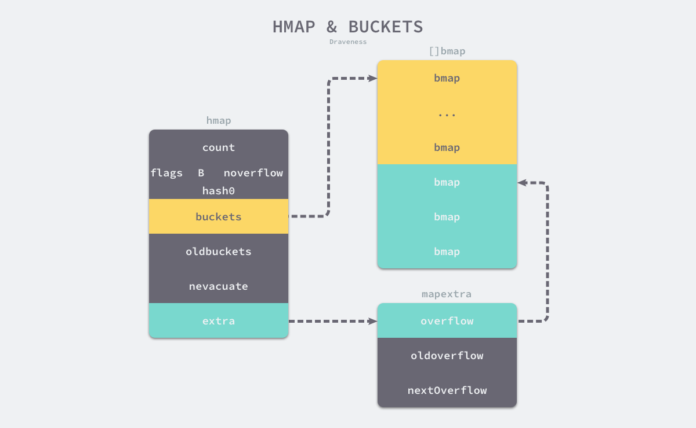
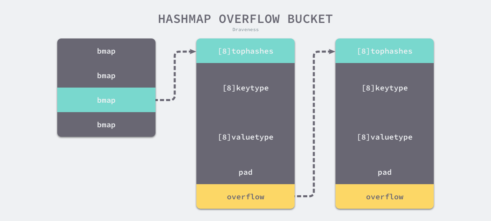

### 0. 概念
    键值对, 可以通过键直接获取其对应的值

### 1. 原理
    O(1)的读写性能

    哈希函数： 尽可能均匀， 减少哈希冲突
    哈希冲突： 开放寻址法（顺序往下找空位（需要伪删除））, 拉链法(Go)

### 2. 数据结构
```
    type hmap struct {
        count int
        flags uint8
        B uint8
        noverflow uint16
        hash0 uint32
        
        buckets unsafe.Pointer
        oldbuckets unsafe.Pointer
        nevacuate uintptr
        
        extra *mapextra
    }
```

    count: 当前哈希表的元素数量
    B: 桶数量， len(buckets) = 2 ** B
    hash0: 哈希的种子， 创建哈希表时确定
    oldbuckets: 哈希扩容时用于保存之前的buckets字段。

    extra: 溢出桶
    bmap: 桶, 存储键值对(每个桶可以存储8个键值对(数组形式))； 存储者键的哈希的高8位(减少访问键)

### 3. 初始化

    字面量： h := map[string]int{"1": 2, "2": 3} 
    make: hash := make(map[string]int, 3)
    

### 4. 读写操作

    _ = hash[key]

    for k, v := range hash {
        // k, v
    }

    hash[key] = value
    hash[key] = newValue
    delete(hash, key)

    访问：
        key -> hash后拿到对应的桶序号 -> 比较桶,溢出桶中存储的key（tophash预比较） 得到value

    
    写入：
        1. 如果找到了，就更新
        2. 如果没找到，则创建， 桶满了 则创建溢出桶（桶存储的是键的地址）

    扩容: (溢出桶太多, 装载因子超过6.5)
        溢出桶太多， 等量扩容， 持续向哈希中插入数据并将它们全部删除时，如果哈希表中的数据量没有超过阈值，就会不断积累溢出桶造成缓慢的内存泄漏; 所以溢出桶太多也会触发扩容；
        
        哈希在存储元素过多时会触发扩容操作，每次都会将桶的数量翻倍，
        扩容过程不是原子的，而是通过 runtime.growWork 增量触发的，
        在扩容期间访问哈希表时会使用旧桶，向哈希表写入数据时会触发旧桶元素的分流。


https://juejin.cn/post/7056228667466203173

3.3.5 小结 #
Go 语言使用拉链法来解决哈希碰撞的问题实现了哈希表，
它的访问、写入和删除等操作都在编译期间转换成了运行时的函数或者方法。
哈希在每一个桶中存储键对应哈希的前 8 位，当对哈希进行操作时，
这些 tophash 就成为可以帮助哈希快速遍历桶中元素的缓存。

哈希表的每个桶都只能存储 8 个键值对，
一旦当前哈希的某个桶超出 8 个，新的键值对就会存储到哈希的溢出桶中。
随着键值对数量的增加，溢出桶的数量和哈希的装载因子也会逐渐升高，超过一定范围就会触发扩容，扩容会将桶的数量翻倍，
元素再分配的过程也是在调用写操作时增量进行的，不会造成性能的瞬时巨大抖动。